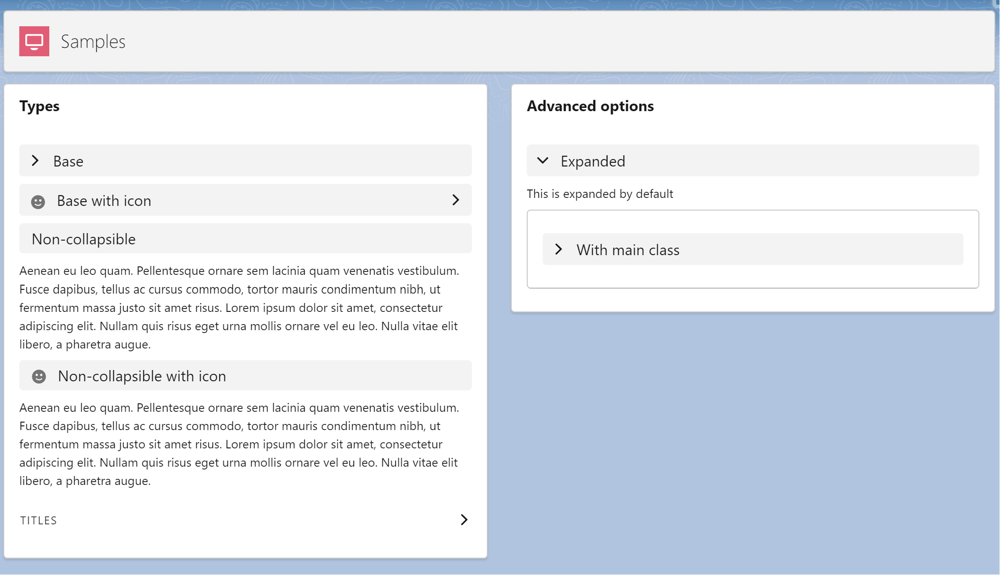

# LWC Expandable Section



## About

Generic SLDS expandable section LWC component.

## Features
- Native SLDS Style
- Support all the SLDS variants
- Icon support
- Integrated on a single component (easy to copy to multiple projects)


## Instructions

### Use on your project
Everything was developed in a single LWC, so you just need a new single component on your project.

- Copy the following files to your project:
    - force-app/main/default/lwc/lwcExpandableSection/**
- Call the component and pass the options
```html
<c-lwc-expandable-section section-title="Expanded" variant="default" expanded>
This is expanded by default
</c-lwc-expandable-section>
```

### Testing and learn how to use it

- Run the `createorg.sh` to create a scratch org
- Open the `LWC Expandable Section` lightning app
- Explore the code on the `samples` component
- Edit the page to preview on mobile devices or login with your mobile device (check the `password.env` file)


## Native component
Do you want to use just a simple accordion section without extra customizations? Use the native SLDS component:

```html
<lightning-accordion active-section-name="A">
    <lightning-accordion-section name="A" label="Accordion Title A">
        This is the content area for section A
    </lightning-accordion-section>
</lightning-accordion>
```
https://www.lightningdesignsystem.com/components/expandable-section/


### Accordion vs Expandable Section
Section Titles are interactive titles that open and close sections, typically on a form. An accordion allows a user to toggle the display of a section of content. Expandable sections are used to break up content into logical groups.

## Properties
| Property                   | Required | Description                                                        | Sample                               |
| -------------------------- | -------- | ------------------------------------------------------------------ | ------------------------------------- |
| `mainClass`                | No       | CSS classes for the main element.                                  | `slds-var-m-bottom_large`                                  |
| `sectionTitle`             | No       | Title or label of the section.                                     | `Filters`                                  |
| `iconName`                 | No       | Name of the icon to be displayed.                                  | `utility:info` |
| `sectionTitleBackgroundColor` | No    | Background color of the section. Default is the normal background color (grey). | `#F3F3F3`                  |
| `variant`                  | No       | Variant of the component. Default is `base`. Options: `base`, `non-collapsible`, `titles`. | `base`                                |
| `expanded`                 | No       | State of the section (expanded or not). Default is `false`.       | `false`                               |


## References

- https://www.lightningdesignsystem.com/components/expandable-section/

